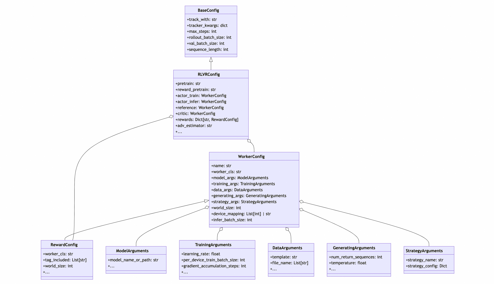

# ROLL 配置系统详解

ROLL 框架采用了一套结构化的配置系统，通过 YAML 文件定义实验参数。本文档将详细介绍 ROLL 的配置设计，帮助新用户理解框架的配置结构和扩展方式。

## 配置系统架构

ROLL 的配置系统主要由以下几个核心组件构成：

### 1. BaseConfig - 基础配置类

`BaseConfig` 是所有配置的基类，定义了实验的基本参数，如：
- 实验名称 (`exp_name`)
- 随机种子 (`seed`)
- 输出目录 (`output_dir`)
- 日志目录 (`logging_dir`)
- 跟踪器配置 (`track_with`, `tracker_kwargs`)
- 训练步数控制 (`max_steps`, `save_steps`, `logging_steps`, `eval_steps`)
- 批处理大小 (`rollout_batch_size`, `val_batch_size`)
- 序列长度设置 (`prompt_length`, `response_length`, `sequence_length`)

### 2. WorkerConfig - 工作节点配置类

`WorkerConfig` 定义了每个工作节点（如训练/推理角色）的配置，包括：
- 模型参数 (`model_args`)
- 训练参数 (`training_args`)
- 数据参数 (`data_args`)
- 生成参数 (`generating_args`)
- 策略参数 (`strategy_args`)
- 设备映射 (`device_mapping`)
- 工作节点数量 (`world_size`)

### 3. PipelineConfig - 流水线配置类

在 RLVR 场景中，`RLVRConfig` 继承自 `BaseConfig`，作为具体的任务的配置类(其他PipelineConfig包括AgenticConfig、DPOConfig、DistillConfig)。它包含了：
- 角色配置（`actor_train`, `actor_infer`, `reference`, `critic`, `rewards`等）
- RL 算法相关参数（`ppo_epochs`, `adv_estimator`, `reward_clip`等）
- 数据处理参数（`max_len_mask`, `difficulty_mask`等）

### 4. Strategy - 策略配置

策略配置定义了每个工作节点使用的训练/推理策略，包括：
- 策略名称（如 `megatron_train`, `vllm`, `sglang`, `deepspeed_train`等）
- 策略特定参数（如张量并行大小、流水线并行大小等）

### 5. Arguments 类

ROLL 使用多个参数类来组织配置：
- `ModelArguments`：模型相关参数
- `TrainingArguments`：训练相关参数
- `GeneratingArguments`：生成相关参数
- `DataArguments`：数据相关参数

## 配置类 UML 图

为了更直观地理解 ROLL的配置系统，以RLVRConfig的UML类图展示：
- BaseConfig提供了最基础的配置key，具体应用的PipelineConfig继承自 BaseConfig
- PipelineConfig中可根据应用需要定义多个WorkerConfig.worker_config之间独立，可自由分配独立的资源，训练/推理后端
- WorkerConfig中按需要定义该角色持有的ModelArguments、TrainingArguments、GeneratingArguments、DataArguments, 后端StrategyArguments
- WorkerConfig可以按需扩展，构造新的应用配置



## YAML 配置与 PipelineConfig 的映射关系

在 ROLL 中，YAML 配置文件与 Python 配置类之间存在直接的映射关系：

1. YAML 文件的顶层字段对应`PipelineConfig`->`BaseConfig` 的属性
2. 角色配置（如 `actor_train`, `actor_infer`）对应 `WorkerConfig` 实例，对应 `PipelineConfig` 中的属性类的配置
3. 每个角色下的子字段（如 `model_args`, `training_args`）对应相应的参数类实例

例如，在 YAML 文件中：
```yaml
actor_train:
  model_args:
    disable_gradient_checkpointing: false
    dtype: bf16
  training_args:
    learning_rate: 1.0e-6
    per_device_train_batch_size: 1
```

映射到 Python 代码中：
```python
config.actor_train.model_args.disable_gradient_checkpointing = False
config.actor_train.model_args.dtype = "bf16"
config.actor_train.training_args.learning_rate = 1.0e-6
config.actor_train.training_args.per_device_train_batch_size = 1
```

## 配置验证机制

ROLL 的配置系统具有严格的验证机制：
1. YAML 中的配置项必须在对应的 Config 类中有明确定义才能使用
2. 通过数据类的类型注解和元数据实现配置项的验证
3. 在 `__post_init__` 方法中进行额外的逻辑验证

这种设计防止了配置项混乱，确保了配置的一致性和正确性。

## 全局环境变量/各角色Worker环境变量 设置入口

在 ROLL 框架中，环境变量的设置分为两个层级：

1. **全局环境变量**：在 `pipeline_config` 上配置 `system_envs`，对整个流水线中的所有角色生效。
2. **各角色Worker环境变量**：在 `worker_config` 里的 `system_envs` 中配置，仅在该 Worker 的 Ray Actor 创建时生效。

### 配置方式

#### 全局环境变量配置

在 YAML 配置文件的顶层设置 `system_envs` 字段：

```yaml
exp_name: "example-exp"
# 其他基础配置...

# 全局环境变量设置
system_envs:
  NVTE_TORCH_COMPILE: '0'
  RAY_PROFILING: "1"

# 角色配置
actor_train:
  # ...
```

#### 各角色Worker环境变量配置

在特定角色的配置中设置 `system_envs` 字段：

```yaml
actor_train:
  model_args:
    # ...
  training_args:
    # ...
  # 仅对 actor_train 角色生效的环境变量
  system_envs:
    NVTE_TORCH_COMPILE: '0'

actor_infer:
  model_args:
    # ...
  generating_args:
    # ...
  # 仅对 actor_infer 角色生效的环境变量
  system_envs:
    NVTE_TORCH_COMPILE: '0'
```

### 优先级规则

当全局环境变量和角色特定环境变量存在冲突时，角色特定环境变量具有更高的优先级，会覆盖全局设置。

通过这种分层的环境变量配置方式，ROLL 框架提供了独立、灵活的环境变量配置能力，满足Worker的不同需求。

## 配置示例解析

以下是对 `example_grpo.yaml` 配置文件的详细解析：

```yaml
# 基础配置
exp_name: "qwen2.5-7B-rlvr-config"  # 实验名称
seed: 42  # 随机种子
logging_dir: ./output/logs  # 日志目录
output_dir: ./output  # 输出目录

# ckpt 保存配置
checkpoint_config:
  type: file_system
  output_dir: /data/cpfs_0/rl_examples/models/${exp_name}

# 跟踪器配置
track_with: tensorboard  # 使用 tensorboard 进行跟踪
tracker_kwargs:
  log_dir: /data/oss_bucket_0/rl_examples/llm/tensorboard/roll_exp/rlvr  # 日志目录

# GRPO 算法相关配置
rollout_batch_size: 64  # rollout 批处理大小
adv_estimator: "grpo"  # 优势估计器使用 GRPO
num_return_sequences_in_group: 8  # 每组返回序列数

# 序列长度配置
prompt_length: 2048  # 提示长度
response_length: 4096  # 响应长度

# 训练参数
ppo_epochs: 1  # PPO 优化轮数
use_kl_loss: true  # 使用 KL 散度损失
kl_loss_coef: 0.001  # KL 损失系数
loss_agg_mode: "seq-mean-token-sum"  # 损失聚合模式

# 优势计算相关
whiten_advantages: true  # 白化优势值
advantage_clip: 2.0  # 优势值裁剪
dual_clip_loss: true  # 使用双重裁剪损失

# 奖励处理
reward_clip: 10  # 奖励值裁剪

# 模型配置
pretrain: Qwen/Qwen2.5-7B  # 预训练模型路径
reward_pretrain: Qwen/Qwen2.5-7B  # 奖励模型路径

# 角色配置
actor_train:  # 训练角色
  model_args:
    disable_gradient_checkpointing: false  # 启用梯度检查点
    dtype: bf16  # 数据类型
  training_args:
    learning_rate: 1.0e-6  # 学习率
    per_device_train_batch_size: 1  # 每设备训练批大小
    gradient_accumulation_steps: 32  # 梯度累积步数
  strategy_args:
    strategy_name: megatron_train  # 使用 Megatron 训练策略
    strategy_config:
      tensor_model_parallel_size: 1  # 张量并行大小
      pipeline_model_parallel_size: 1  # 流水线并行大小
  device_mapping: list(range(0,16))  # 设备映射

actor_infer:  # 推理角色
  model_args:
    disable_gradient_checkpointing: true  # 禁用梯度检查点
    dtype: bf16  # 数据类型
  generating_args:
    max_new_tokens: ${response_length}  # 最大新 token 数
    temperature: 0.99  # 温度参数
  strategy_args:
    strategy_name: vllm  # 使用 vLLM 推理策略
    strategy_config:
      gpu_memory_utilization: 0.8  # GPU 内存利用率
  device_mapping: list(range(0,12))  # 设备映射

# 奖励模型配置
rewards:
  math_rule:  # 数学规则奖励
    worker_cls: roll.pipeline.rlvr.rewards.math_rule_reward_worker.MathRuleRewardWorker  # 工作类
    model_args:
      model_name_or_path: ${reward_pretrain}  # 模型路径
    tag_included: [deepmath_103k, aime]  # 包含的标签
    world_size: 8  # 工作节点数量
```

希望通过以上解析，用户可以更好地理解 ROLL 配置系统的结构和使用方法。