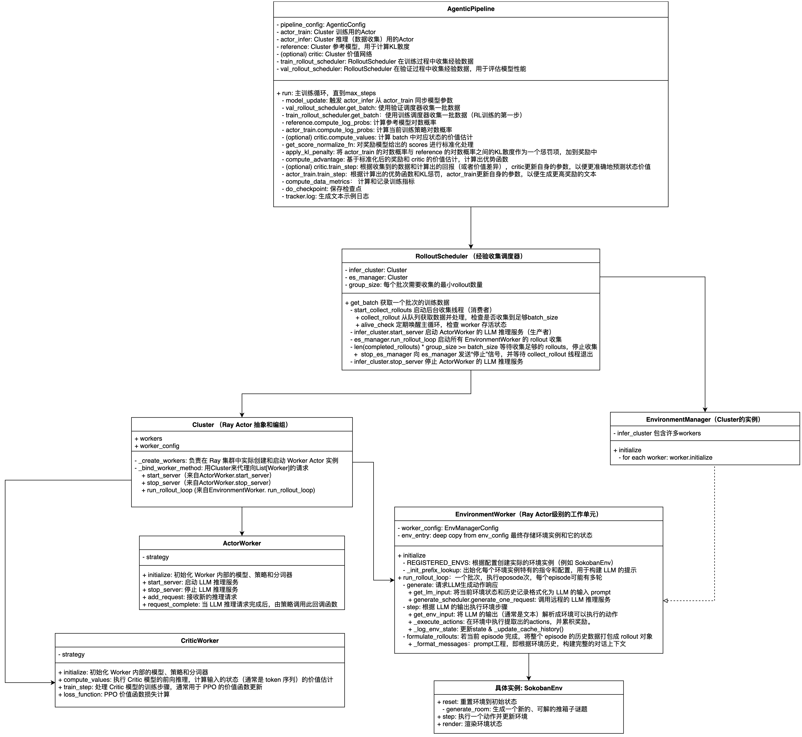

# AgenticPipeline

## Agentic Pipeline 架构图



## AgenticPipeline

AgenticPipeline是ROLL框架中的核心组件，用于智能体(Agentic)的强化学习训练。AgenticPipeline继承BasePipeline，实现了基于Actor-Critic架构的PPO(Proximal Policy Optimization)算法，为大语言模型的智能体训练提供了完整的分布式训练管道。

### 主要属性

####   核心配置
    

*   pipeline\_config: AgenticPipeline类的核心配置对象，类型为AgenticConfig，包含了整个强化学习训练管线的所有配置参数。
    

####   Actor-Critic架构集群
    

*   actor\_train: AgenticPipeline中的策略网络训练集群，负责执行PPO算法的核心训练逻辑。
    
*   actor\_infer: AgenticPipeline中的策略网络推理集群，负责与环境交互生成训练数据。
    
*   reference: AgenticPipeline中的参考模型集群，作为策略优化过程中的基准模型，用于计算KL散度。
    
*   critic(optional): 估计状态价值函数(仅在GAE模式下使用)
    

####  环境交互调度器
    

*   train\_rollout\_scheduler: 训练过程中收集经验数据，其中infer\_cluster=actor\_infer
    
*   val\_rollout\_scheduler: 验证过程中收集经验数据，用来评估模型性能，其中infer\_cluster=actor\_infer
    

####   控制器和辅助工具
    

*   kl\_ctrl: 自适应调整KL惩罚系数，防止策略更新偏离参考策略过远
    

*   tokenizer: 处理文本的编码和解码
    

*   running: 计算和维护运行时的统计信息
    

### 核心流程

```python
def run():
    初始化 TPS 计时器
    for global_step in range(max_steps):
        # 1. 模型状态管理
        更新模型参数 (actor_train -> actor_infer)
        # 2. 评估阶段 (每隔eval_steps执行)
        if global_step % eval_steps == 0:
            batch = 验证环境rollout(val_batch_size)
            计算评估指标 (score均值/最大值/最小值)
            保存渲染结果 (可选) 
        # 3. 训练数据收集
        batch = 训练环境rollout(rollout_batch_size)
        # 4. 计算关键概率和值
        ref_log_probs = reference模型.计算对数概率(batch)
        old_log_probs = actor_train模型.计算对数概率(batch)
        if 使用GAE估计器:
            values = critic模型.计算值函数(batch)
        # 5. 奖励处理和优势计算
        按组归一化奖励分数
        应用KL惩罚
        计算优势函数 (GAE或其他方法)
        # 6. 模型训练
        if 使用GAE估计器:
            critic模型.训练步骤(batch)
        if global_step > critic_warmup:
            actor模型.训练步骤(batch)
        # 7. 记录和保存
        记录训练指标
        保存检查点
        打印样本日志 (每隔logging_steps)
```

#### model\_update

同步训练模型参数到推理模型，确保用于生成rollout数据的推理模型使用最新的训练参数。在PPO算法中，训练模型actor\_train负责参数更新和梯度计算，推理模型actor\_infer负责生成rollout数据，为了确保训练一致性，推理模型需要定期同步最新的训练数据，这样生成的rollout数据才能反应当前策略的真实表现。

```python
#初始化阶段设置同步对
self.set_model_update_pair(
            src_cluster=self.actor_train,
            tgt_cluster=self.actor_infer,
      frequency=self.pipeline_config.actor_train.model_update_frequency,)

#在训练循环中执行同步
model_update_metrics: Dict = self.model_update(global_step)
metrics.update(model_update_metrics)
```

#### train\_rollout

生成用于训练的rollout数据，即让智能体与环境交互产生经验数据（状态、动作、奖励序列）。

```python
self.train_rollout_scheduler.get_batch(batch, self.pipeline_config.rollout_batch_size)
```

#### val\_rollout

使用验证集的rollout调度器生成一批验证数据。每隔eval\_steps步，验证一次

```python
self.val_rollout_scheduler.get_batch(batch,self.pipeline_config.val_batch_size)
```

#### cal\_ref\_log\_probs

`reference.compute_log_probs`计算reference model对当前batch数据的对数概率。用于后续的KL散度惩罚计算，防止训练策略偏离初始策略太远。

#### cal\_old\_log\_probs\_values

计算当前训练模型对rollout数据的对数概率（旧策略概率）和值函数估计，是PPO算法中计算重要性采样比率(importance sampling ratio)的关键步骤。其中，actor\_train.compute\_log\_probs，使用当前训练模型计算对rollout数据的对数概率。critic.compute\_values，如果使用GAE，同时计算状态值函数。

```python
self.actor_train.compute_log_probs(batch, blocking=False)
if self.pipeline_config.adv_estimator == "gae":
  self.critic.compute_values(batch, blocking=False)
```

#### adv 

实现了奖励处理和优势计算，这是PPO算法中的核心步骤，负责将环境奖励转换为训练信号。

*   `get_score_normalize_fn`对奖励模型给出的 scores 进行标准化处理
    
*   `apply_kl_penalty`将 actor\_train 的对数概率与 reference 的对数概率之间的KL散度作为一个惩罚项，加到奖励中。
    
*   `compute_advantage`基于标准化后的奖励和 critic 的价值估计，计算出优势函数。
    

#### critic.train\_step (optional) 

根据收集到的数据和计算出的回报（或者价值差异），critic更新自身的参数，以便更准确地预测状态价值。

```python
if self.pipeline_config.adv_estimator == "gae":
    self.critic.train_step(batch, blocking=False)
```

#### actor\_train.train\_step  

`actor_train.train_step`根据计算出的优势函数和KL惩罚，actor\_train更新自身的参数，以便生成更高奖励的文本。

#### compute\_data\_metrics

计算和统计训练数据的关键指标，为监控训练过程提供全面的数据分析

#### do\_checkpoint

保存检查点

#### tracker.log

生成文本示例日志
